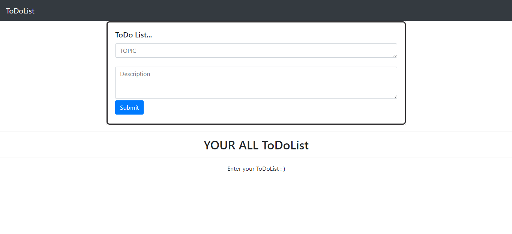
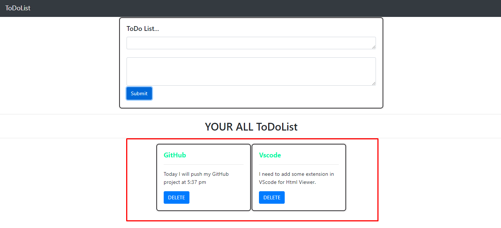

#TodoNotes First Javascript Project with Some javascript, HTML and Css...

1.
 
2. 

Introductions - [Onboarding Specialist] &amp; [Client Name]
Call Objective: Launch your 1st edition
Review marketing objectives &amp; goalsObjective of the newsletter: [Newsletter Objective]
Topics we’ll cover today:AI Analysis of your company &amp; avatar
Newsletter Setup - Examples &amp; Preview
Subscribe/Opt-in Page Setup - This is where you send traffic to opt-in to your newsletter
Audience - Who we’ll be sending to
Next Steps - Things you’ll need to do
AI Analysis - [Company Name]
[Insert AI Analysis]
Content Topics &amp; Curation
We will only curate from reputable publications and industry thought leaders for the topics below
[Insert Content Categories]
Newsletter Setup
Examples of top performing newsletters:
Example: Joe PolishJoe curates his own content in his top card, drives readers to a landing page to attend his event, and curates 3rd party content
Example: Dan MartellDan curates mostly his own content since he has a ton of high engaging evergreen content. His CTA drives users to his Instagram DMs where the reader is pre-qualified for various products.
Note: Our newsletter template is battle tested for rendering, loading speed, and deliverability across multiple devices, browsers, email clients (Gmail, Outlook, etc.) and operating systems.
Not Customizable: We use a single column layout. This is the only layout currently available at this time. Font &amp; Font Size.
Customizable: Content, Copy, Writing Style
[Newsletter Name] [Hyperlink Newsletter Preview Link]
Send From Name &amp; Send From Email: Please make sure you have this inbox set up as an alias or inbox to receive replies and have a process to manage replies.
Send From Name: [sendfrom_name]
Send From Email (ex. Gar Lee <a href="mailto:&#x67;&#x61;&#x72;&#x40;&#x64;&#97;&#105;&#108;&#121;&#x2e;&#97;&#105;">&#x67;&#x61;&#x72;&#x40;&#x64;&#97;&#105;&#108;&#121;&#x2e;&#97;&#105;</a>): [sendfrom_email]
Content categories which appear at the top right of each card in the newsletter.
If you create your own content, it is best practice to feature that on your newsletter. The best performing/highest authority newsletters feature the brand’s own content at the top.
[Insert Link to Blog]
[Insert Link to Podcast]
[Insert Link to YouTube]
Offer/Ad - Confirm what offer or ad you’d like to display in your custom card. This is the action you want your audience to eventually take.
Landing Page URL for your Custom Card:
Resources:
See Custom Card Example:
Examples of CTA landing page experiences
<a href="https://daily.ai/">https://daily.ai/</a>
<a href="https://geniusnetwork.com/event/">https://geniusnetwork.com/event/</a>
<a href="https://live.geniusu.com/ai/entrepreneur/">https://live.geniusu.com/ai/entrepreneur/</a>
Subscribe/Opt-in Funnel
This is the page where new subscribers opt-in, share with friends (optional), and get a lead magnet freebie.
Let’s take a look at an example: subscribe.danmartell.comLead Magnet (Optional)
[Subscribe Link] if not available, [Preview Subscribe Link]
Audience &amp; Technical Details
Do you currently send email? [CRM]
List Size? [List Size]
We ran your list through Mailgun to clean out spam traps and undeliverables. If you have a list of over 5k, we’ll be subsegmenting your list into warm up cohorts starting with 2k, 4k, 8k, with each newsletter send and so on until your whole list has been activated.
[Insert Cleaned CSV]
[Insert Mailgun Screenshot]
DNS Access - Allows us to send email from domain + host subscribe page
Next Steps &amp; Expectations
A few days before we launch the first edition of the newsletter, we’ll send a text only activation email announcing the newsletter which results in higher open rates and lower unsubscribes.
See Activation Copy here:
Frequency &amp; Sending Day: We’ve found the best open rates for newsletters sent on Tuesdays, Wednesdays, and Thursdays. Any preference? 1.
Approvals Process:
Once we launch your first edition, we’ll be sending the next draft of next week’s edition for your approval on Friday morning the week before it’s scheduled to send. Please provide approval or changes by Friday EOD so we can make changes and schedule.
One change/edit/approval round:
Design &amp; Copy Changes to the newsletter/subscribe page takes up to 48 hours
Target Go Live Date:
Let’s Review Progress &amp; Action Items
[ ] Confirm Newsletter Name
[ ] Confirm Send From Email &amp; Send From Name
[ ] Confirm Creative Assets
[ ] Schedule Newsletter Review Call
[ ] Confirm Offer Card Details: w/ Landing Page URL, Copy &amp; Image 1200px
[ ] Provide CSV of audience
[ ] We’ll create DNS records
[ ] Update DNS or give us your credentials
[ ] Meet in a week to review 1st edition
[CSV]
[Logo]
[Headshot]
[Writing Sample]
Call Objective: Launch your 1st edition
Review marketing objectives &amp; goalsObjective of the newsletter: To provide unique lending solutions, industry analyses and successful case histories to real estate professionals across the country, helping them secure funding effectively.
Topics we’ll cover today:AI Analysis of your company &amp; avatar
Newsletter Setup - Examples &amp; Preview
Subscribe/Opt-in Page Setup - This is where you send traffic to opt-in to your newsletter
Audience - Who we’ll be sending to
Next Steps - Things you’ll need to do

